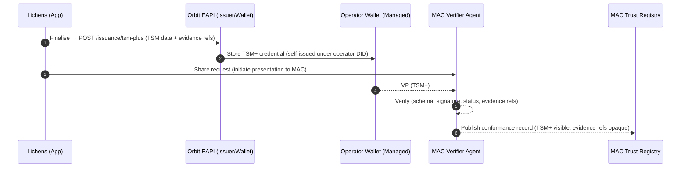
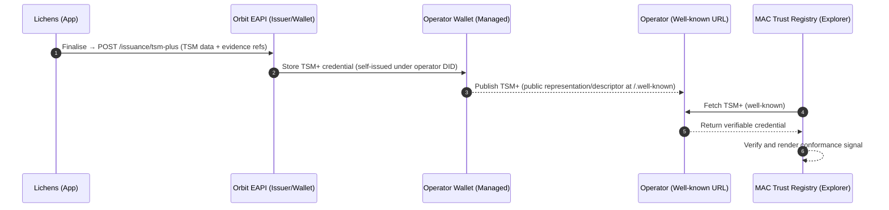

# Technical Requirements — Lichens × Orbit EAPI × MAC Trust Registry (TSM+)

> **Status:** Draft v0.1  
> **Owner:** Northern Block (Engineering)  
> **Partners:** Lichens, Mining Association of Canada (MAC)

### Version History

| Ver. | Date       | Notes                                                                                     |
|------|------------|-------------------------------------------------------------------------------------------|
| **0.1** | 03-Oct-2025 | Initial draft                                                                          |

---

## 0. Introduction

Lichens is a platform used by mining operators to capture, organise, and manage the evidence (files and data) needed for sustainability reporting. Lichens helps teams collaborate and complete disclosures against standards such as Towards Sustainable Mining (TSM).

Historically, Northern Block struggled to deliver enough day-to-day utility through a wallet experience for operators to convert those reports into signed digital credentials. With limited market pull for credentialled sustainability reports, operators were content to “check the box” at minimum cost. Platforms like Lichens, however, already deliver clear operational value—ten operators actively use Lichens today—by streamlining multi-stakeholder collaboration for compliance.

External pressure is rising. Canadian and European regulators are pushing for greater transparency in critical-minerals supply chains; the G7 is coordinating traceability in diamond supply chains (e.g., Kimberley Project) to prevent conflict funding; and traceability obligations will become a legal requirement in the EU in 2026, affecting Canadian exporters.

Signed digital credentials address these needs. Through our work on the United Nations Transparency Protocol (UNTP), we’re adopting an architecture where value-chain participants issue and publish signed claims at well-known URLs. Third parties (regulators, buyers, investors) can retrieve and verify these claims—and link them across the data layer—without a centralised repository. This approach scales, avoids vendor lock-in, and leverages signatures over verified data.

Our pilot with Lichens embeds evidence-backed “TSM+” credentialing directly in the Lichens user journey. When an operator finalises a TSM report, the system produces a digitally signed, verifiable credential—without extra UX steps. Operators can share the result downstream (buyers, investors, partners), and MAC can publish conformance signals to the Trust Registry to increase market confidence.

**Related context:**  
- Credential schema notes: <https://github.com/Northern-Block/credential-governance-docs/blob/main/mining-association-of-canada/lichens_project_overview.md>

---

## 1. Definition — What is **TSM+**?

**TSM+** is a signed digital credential that packages:
- the **core TSM performance data** for a mine/site and reporting period; and
- **durable evidence references** (URIs/URLs and optional hashes) that substantiate the report.

For the MVP, **all TSM+ credentials are self-issued by the mining operator** (years 1–3). MAC acts as a **verifier** and **publisher** to the Trust Registry (no third-party auditor involvement in MVP).

Additional properties:
- **Evidence-aware** — binds claims to evidence pointers (evidence remains private to the operator; the credential can later enable authorised access flows).
- **Portable & verifiable** — relying parties can independently verify.
- **Publishable** — MAC publishes a conformance signal to the MAC Trust Registry after verification.

> _Note:_ TSM+ aligns to MAC’s TSM performance credential materials while extending with evidence-link conventions and registry publication flows.

---

## 2. Goals & Non-Goals

### 2.1 Goals
- Embed **evidence-backed TSM+ signing** directly in the Lichens flow with **minimal added user steps**.
- Generate a **signed credential** that includes core TSM fields + evidence references.
- Enable **selective sharing** and **downstream verification**; support **MAC Trust Registry** publication post-verification.

### 2.2 Non-Goals
- Replacing Lichens’ evidence repository or reporting UI.
- Building a central data store for operator content (no new centralised repository).
- Introducing third-party auditor issuance in MVP (may revisit post-MVP).

---

## 3. Context & Rationale

- Tightening transparency and traceability drivers; UNTP-aligned patterns; EU obligations from 2026.  
- Operational value: UX-invisible issuance, registry-visible conformance signals for market confidence.

---

## 4. Roles & Personas

- **Operator Contributor** — prepares evidence & data in Lichens.  
- **Operator Approver** — authorises final sign/publish action.  
- **MAC Verifier** — verifies proofs and controls publication to the Trust Registry.  
- **External Relying Party** — buyers, investors, regulators consuming proofs/records.

> _Removed for MVP:_ Third-party auditors.

---

## 5. High-Level Architecture & Flows

### 5.1 Systems

- **Lichens App** — evidence & reporting system of record.  
- **Orbit EAPI** — Issuer/Wallet/Verifier services (NB-managed).  
- **Operator Wallet (managed)** — hosted wallet bound to operator DID (NB-managed).  
- **MAC Verifier Agent** (operated by NB for MAC).
- **MAC Trust Registry** (operated by NB for MAC).

### 5.2 Happy Path (TSM+, MVP — self-issuance and MAC verification)

1. Operator finalises TSM report in **Lichens**.  
2. Lichens server calls **Orbit Issuance** with LoB ID, API key, and payload (mine/site IDs, period, TSM data, evidence pointers).  
3. **Orbit** issues **TSM+** and stores it in the operator’s **managed wallet** (bound to the operator DID).  
4. The operator (via Lichens) **shares** a proof presentation with **MAC** as relying party.  
5. **MAC** verifies; on success, **publishes** a conformance record to the **Trust Registry**.

#### Diagram — MVP flow



### 5.3 Future (UNTP-style publication via well-known URL)

- Each self-issued TSM+ credential is discoverable at the operator’s **well-known URL**.
- **MAC TR** acts as an **explorer**, indexing the operator’s URL (avoids needing MAC to receive a proof first; keeps the **operator** as system of record).



## 6. Data Model & Schemas

### 6.1 Credential Format

- **Option A (preferred):** JSON-LD VC (web-scale discovery/verification).
- **Option B:** Indy/AnonCreds (support where legacy stacks require it).
- **Decision:** **TODO:** choose the primary/official format for TSM+; ensure the other format via conversion or dual-issuance if needed.

### 6.2 Core Attributes

- Align with MAC’s TSM Performance Credential schema (e.g., site identifiers, period, protocol scores).  
- **Evidence references object:**  
  ```json
  {
    "uri": "https://evidence.example/path",
    "hash": "sha256-Base64URL...",      // optional if repository guarantees integrity
    "mediaType": "application/pdf",     // optional
    "title": "2024 External Audit Report", // optional
    "issuedOn": "2025-09-30"            // optional
  }

- **Issuer**: operator DID (self-issuance baseline).
- **Proof**: signature suite TBD (Orbit standard suite).

### 6.3 Evidence Integrity

- Hashing algorithm(s) and canonicalisation rules (e.g., SHA-256).
- Max object sizes; allowed MIME types; access policy for protected evidence.
- Redaction policy for PII/commercial sensitivity (evidence pointer stable; payload redacted where required).

## 7. API Integration (Orbit EAPI)

### 7.1 Authentication

- <code>x-lob-id</code> + <code>x-api-key</code> per tenant; optional mTLS for partner-to-partner calls.

### 7.2 Issuance

  ```http
POST /eapi/issuance/tsm-plus
Headers: x-lob-id, x-api-key
Body:
{
  "operator_did": "did:web:example.com",
  "mine_id": "MINE-123",
  "facility_id": "FAC-9A",              // optional if modelling facilities
  "reporting_period": "2024",
  "tsm_payload": { /* MAC-aligned fields */ },
  "evidence": [
    { "uri": "https://...", "hash": "sha256-...", "mediaType": "application/pdf" }
  ],
  "options": { "format": "jsonld", "async": true }
}
Responses:
  201 Created   // sync
  202 Accepted  // async job id
```

### 7.3 Presentation Push (Wallet → MAC)

  ```http
POST /eapi/presentations/push
Body:
{
  "credential_id": "cred_abc123",       // or vp_token
  "audience": "mac",
  "presentation_definition_id": "tsm-plus-v1"
}
```

### 7.4 Verification Callback (MAC → Orbit)

  ```http
POST /webhooks/verification-result
Body:
{
  "presentation_id": "pres_789",
  "status": "verified" | "failed",
  "checks": { "issuerBinding": true, "schema": true, "expiry": true },
  "published_registry_record_id": "reg_456"   // when applicable
}
```

### 7.5 Error Envelope

  ```json
{ "code": "EAPI_ISSUANCE_FAILED", "message": "Human-readable", "details": {}, "trace_id": "abc-123" }
```

### 7.6 Operator DID & Wallet Provisioning

- Requirement: NB provides a service to provision DIDs for each mining operator organisation and to host a managed wallet per operator.
- Behaviour:
  -   Each company user in Lichens is mapped to an operator context; issuance uses the operator DID and associated keys.
  -   On “finalise” in Lichens, back-end triggers self-issuance using the operator DID/key material and stores the credential in the operator’s managed wallet.
- Admin APIs (illustrative):

```http
POST /eapi/dids/provision
Body: { "operator_id": "OP-001", "method": "did:web", "domain": "operator.example" }
POST /eapi/wallets/provision
Body: { "operator_id": "OP-001" }
```

## 8. UX Integration (Lichens)

- **Trigger**: “Finalise Report” → silent server-to-server issuance.
- **Feedback**: Non-blocking toast: “Signed TSM+ credential created.” Link to “Share / Copy verification link”.
- **No added steps** unless an **Approver** confirmation is configured.

## 9. “Mining TR” Design Decisions

> The following converts every item from the “Mining TR” notes into explicit decisions/questions.

### 9.1 Scope & Operations

- this the MAC Trust Registry or a broader Mining TR?
- Who operates it? TODO: decide operator of record (MAC-operated vs NB-run vs hybrid).

### 9.2 Holder Model (Mines only)

Facilities as holders.

### 9.3 Verifier (MAC only)

Model MAC as the Verifier.

Single tenant for MAC verifier agent.

### 9.4 Issuer (Mines / MAC / Auditor)

JSON-LD

### 9.5 DID Methods

Holders’ DIDs: did:web

Issuers’ DIDs: did:web

### 9.6 Tenant Model

- **If mines always issue (all three years):** keep mines in the **“Mining Operators (Prod)”** multi-tenant agent; only carve out single-tenant on exception. **MAC remains single-tenant as verifier.** Auditors are **out of scope** for MVP and default to multi-tenant if introduced later.

### 9.7 Indy-Specific Items

NA

### 9.8 Onboarding

Mines / Facilities onboarding

Any governance requirements?

What form do they fill / what data do they provide about themselves?

Auditors onboarding

Any governance requirements?

Do they provide proof of TSM auditor status?

What form/data do they provide about themselves?

MAC onboarding (as verifier, not operator)

Any governance requirements?

What form/data do they provide about themselves?

Note: “Decide for holders” — confirm holder auto-accept/auto-present defaults and DID/tenant choices.


## 14. Acceptance Criteria (MVP)

From Lichens Finalise, a TSM+ credential is created and stored (no extra UI).

A proof is pushed to MAC and verified successfully.

MAC can publish a corresponding record to the Trust Registry.

An external relying party can fetch and verify both the credential and the registry record via public endpoints.

End-to-end logs show a complete, correlatable trail (report → issuance → proof → verification → publication).


## 16. Open Questions

Primary credential format (JSON-LD vs Indy) and cross-format strategy.

Year-3 issuance authority: auditor vs MAC vs self (policy + UX).

Holder auto-accept / auto-present defaults.

DID methods per role (mine, auditor, MAC) and hosting approach.

Candy-dev permissions & process to register Indy credential definitions and issuers.

Minimum evidence metadata (is hash mandatory?).

Tenant model finalisation for mines and auditors.

## 17. Implementation Timeline (placeholder)

Week 1–2: Schema finalisation, Lichens integration stub.

Week 3–4: Staging E2E happy path.

Week 5: MAC verification & registry publication dry-run.

Week 6: Pilot sign-off.


